# Operaciones con Espacios de Estados

Un modelo de espacios de estados es una forma matemática de representar un sistema físico utilizando un conjunto de variables de entrada, salida y estados, las cuales están conectadas a través de ecuaciones diferenciales de primer orden. Las variables de estado determinan los valores de las variables de salida del sistema [1].

## Espacio de estados a partir de una Función de transferencia

Se considera una función de transferencia si tiene la siguiente estructura:

$$G_{(z)} = \frac{b_{0}z^{n} + b_{1}z^{n-1} + \cdots + b_{n-1}z + b_{n}}{z^{n} + a_{1}z^{n-1} + \cdots + a_{n-1}z + a_{n}}$$

A partir de esta aclaración, es posible representar una función de transferencia en diferentes formas clásicas de espacio de estados. Algunas de estas formas facilitan el análisis y el diseño de sistemas y controladores.

## Formas de Espacio de Estados 
### Forma Canónica Controlable
* El orden del polinomio caracteristico corresponde al número de ecuaciones del sistema.
* En la matriz, los signo de los términos cambian y se organizan desde el término independiente hasta el mayor grado.

$$y_{k} = [Numerador][X_{n}(k)]$$

* Si se tiene la función:

$$ G_{(z)} = \frac{b_{0}z^{n} {\color{Green}+ b_{1}}z^{n-1} + \cdots {\color{Green}+ b_{n-1}}z {\color{Green}+ b_{n}}}{z^{n} {\color{Green}+ a_{1}}z^{n-1} + \cdots {\color{Green}+ a_{n-1}}z {\color{Green}+ a_{n}}} $$

A partir de la función de transferencia obtenida, se puede determinar la forma canónica controlable. En este proceso, se observa un cambio de signo en las variables del denominador (destacadas en verde).

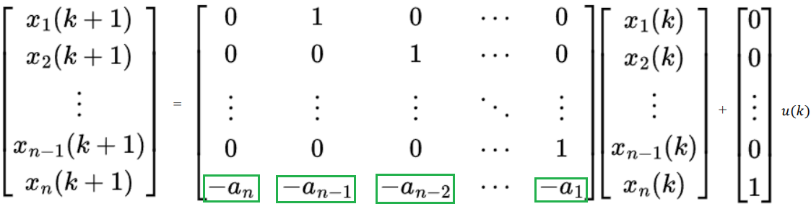

Figura 1. Forma Canónica Controlable.

Para la salida se toman los valores del numerador sin cambiar el singo y se multipla por el vector de variables de estado.

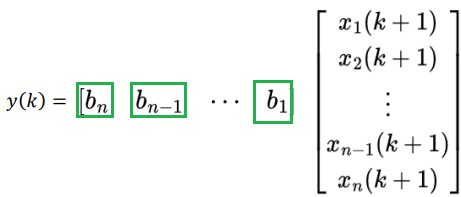

Figura 2. Forma Canónica Controlable - Salida.

En la Figura 2 se observa que los ceros del sistema (numerador) aparecen en la ecuación de salida.

### Forma Canónica Observable
Este sistema es equivalente a la Forma Canónica Controlable.

$$G_{(z)} = \frac{b_{0}z^{n} + {\color{Blue}b_{1}}z^{n-1} + \cdots +{\color{Blue}b_{n-1}}z + {\color{Blue}b_{n}}}{z^{n} {\color{Green}+ a_{1}}z^{n-1} + \cdots {\color{Green}+ a_{n-1}}z {\color{Green}+ a_{n}}} $$

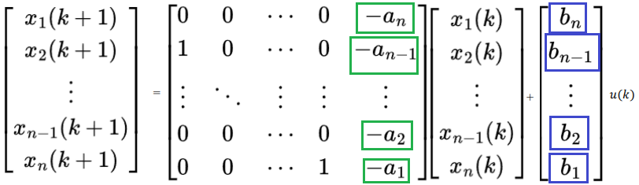

Figura 3. Forma Canónica Observable.

En la Figura 3 se observa que los ceros del sistema (numerador) ya no aparecen en la ecuación de salida, sino en la ecuación de entrada.

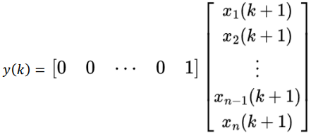

Figura 4. Forma Canónica Observable - Salida.

Toda la matriz de salida se rellena con ceros, excepto el último valor, el cual se coloca en 1.

### Forma Canónica Diagonal
No se trabaja directamente con los coeficientes de la función de transferencia, sino que se determinan directamente los polos de la misma.

$$ P_1 = z_1; P_2 = z_2; \cdots ; P_n = z_n$$

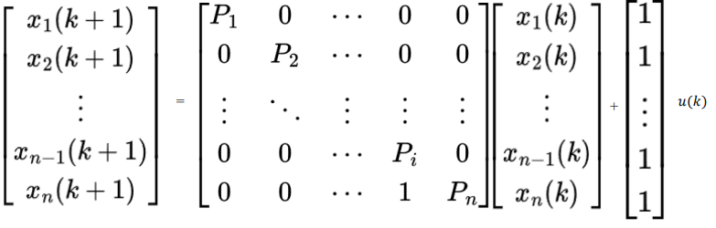

Figura 5. Forma Canónica Diagonal.

En la Figura 5, se observa que los polos deben ubicarse a lo largo de toda la diagonal. La matriz de entrada se completa con el valor 1.

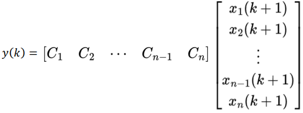

Figura 6. Forma Canónica Diagonal - Salida.

En la matriz de salida (Figura 6), se muestran los valores de las fracciones parciales, obtenidos a partir de la separación de los polos.

## 💡Ejemplo 1

$$G_{(z)} = \frac{z + 1}{z^{2} + 1.3z + 0.4}$$
### Forma Canónica Controlable

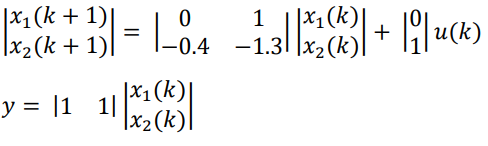

Figura 7. Forma Canónica Controlable - Ejemplo.

### Forma Canónica Observable

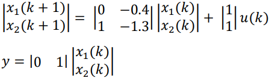

Figura 8. Forma Canónica Observable - Ejemplo.

### Forma Canónica Diagonal

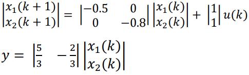

Figura 9. Forma Canónica Diagonal - Ejemplo.

Al ser una función de segundo orden se obtienen matrices 2x2.

## Espacio de Estados  a Función de Transferencia
El proceso consiste en obtener la función de transferencia a partir de la representación en espacio de estados.

$$x(k +1) = Ax(k) + Bu(u)$$
$$y(k) = Cx(k) + Du(k)$$

* Se aplica la transformada Z, como se esta buscando la función de transferencia todas las condiciones iniciales son 0:
  
$$zX(z) = AX(z) + BU(z)$$
$$Y(z) = CX(z) + DU(z)$$

* Se despeja salida sobre entrada:

$$zX(z) - AX(z) = BU(z)$$
$$(zI - A)X(z) = BU(z)$$
$$X(z) = (zI - A)^{-1}BU(z)$$
$$Y(z) = CX(z) + DU(z)   \to   Y(z) = C((zI - A)^{-1}BU(z)) + DU(z)$$
$$Y(z) = C((zI - A)^{-1}BU(z)) + DU(z)  \to \frac{Y(z)}{U(z)} = C((zI - A)^{-1}B) + D$$

## 💡Ejemplo 2

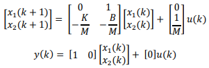

Figura 10. Matrices.

Se aplica la ecuación calculada anteriormente obteniendo:

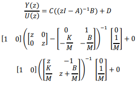

Figura 11. Fórmula general.

Se realzia el cálculo de la inversa por cofactores:

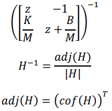

Figura 12. Inversa y Adjunta.

Resolviendo la matriz de cofactores:

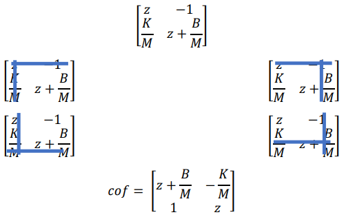

Figura 13. Resolviendo por cofactores.

Cálculo de la transpuesta:

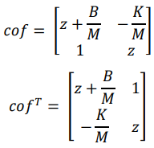

Figura 14. Transpuesta de matriz.

Cálculo del determinante:

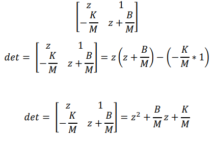

Figura 15. Determinantes.

### Retomando los resultados:

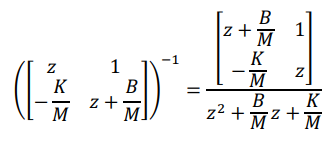

Figura 16. Respuesta inicial.

Se resuelven las siguientes matrices:

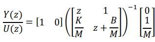

Figura 17. Descomposición de matrices.

Se desarrolla la inversa, obteniendo:

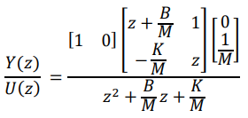

Figura 18. Resolviendo la Inversa.

Ahora se realiza la multiplicación matricial:

$$(1)(z + \frac{B}{M}) + (0)(-\frac{K}{M}) = z + \frac{B}{M}$$
$$(1)(1) + (0)(z) = 1$$

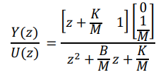

Figura 19. Multiplicación entre matrices.

Producto entre matrices:

$$(z + \frac{B}{M})(0) + (1)(\frac{1}{M}) = \frac{1}{M}$$

Y se obtiene:

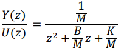

Figura 20. Ecuación Final.

Coincide que el sistema tiene 2 variables de estado, se debe tener un polinomio de segundo orden.

## 📚Ejercicios

$$G_{(z)} = \frac{z + 1}{z^{2} + 10.6z + 4.9}$$

Forma Canónica Controlable

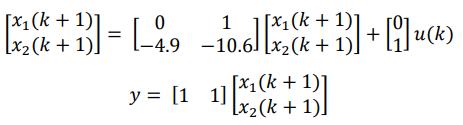

Figura 21. XXXXX.

Forma Canónica Observable

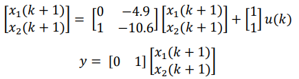

Figura 22. XXXXX.

### Espacio de Estados  a Función de Transferencia

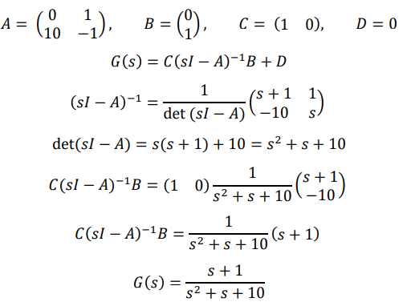

Figura 23. XXXXX.

# Conclusiones
1. La forma canónica controlable y la forma observable son equivalentes en cuanto a su respuesta. Sus características, al estructurar las matrices, facilitan ciertos cálculos.
2. La versatilidad del enfoque de espacio de estados en sistemas de control radica en su capacidad para modelar y analizar sistemas dinámicos complejos a través de sus variables internas. Este enfoque proporciona una perspectiva detallada y flexible, lo cual simplifica tanto el análisis como el diseño de controladores.
3. Los polos del sistema, obtenidos a partir de las matrices de estado, son esenciales para comprender su estabilidad y comportamiento. Esta información es crucial para diseñar sistemas que mantengan la estabilidad y respondan de manera adecuada ante perturbaciones.

# Referencias
[1]. “ss - Modelo de espacio de estados - MATLAB - MathWorks América Latina”, Mathworks.com. [En línea]. Disponible en: https://la.mathworks.com/help/control/ref/ss.html. [Consultado: 02-nov-2024].

[2]. “AulasVirtualesECCI: Entrar al sitio”, Edu.co. [En línea]. Disponible: https://aulas.ecci.edu.co/course/view.php?id=9304 . [Consulta: 09 de Octubre de 2024].

